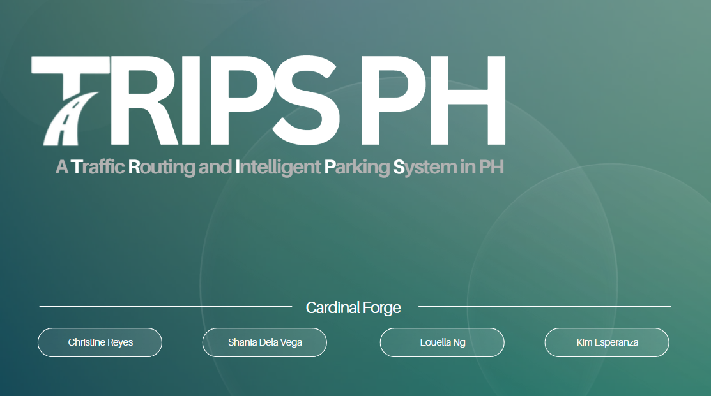

  

# TRIPS PH: A Traffic Routing and Intelligent Parking System in the Philippines
**TRIPS PH**, a Traffic Routing and Intelligent Parking System is a submission for MMITS Bagong Gawi, Bagong Galaw Challenge 2026 hosted by the MMDA and the Japan Intl. Cooperation Agency (JICA). From a direct description from their form: 
"MMDA, through a grant from the Japan International Cooperation Agency (JICA), is implementing the Project for Capacity Enhancement on Traffic Management with Improvement of Intelligent Transportation Systems (ITS) in Metropolitan Manila (MMITS Project). This technical cooperation project seeks to strengthen urban traffic management in the National Capital Region through institutional capacity building and the advancement of ITS development.

As part of this output, MMDA and JICA is organizing the MMITS Bagong Gawi, Bagong Galaw Challenge, a smartphone application development challenge aimed to engage innovators in developing digital applications that encourage positive behavioral changes among road users. 

The Challenge supports the promotion of travel demand management (TDM) and traffic management (TM) strategies through the development of a user-centered application that enables road users to make informed travel decisions."

---

**TRIPS PH** is under the team **Cardinal Forge**, affiliated with Mapua University, where:
- **Christine Julliane Laure Reyes** - Lead Developer, Core Systems Application and Complex AI Integration (OIE)
- **Shania Keith Dela Vega** - Project Manager, MMDA and External API Integration + Architecture
- **Louella Josephine Ng** - Business Analyst, Live Map Visualization and Risk Layer Designer
- **Kim Caryl Esperanza** - Strategy Lead, Data Analytics and Reporting Module + UI/UX Designer

_Entered: April 22, 2026_

---

## Relevant Documents and Files
[Working Doc](https://docs.google.com/document/d/1E3p7VCVAvXNghofW3FSRjMIfbqWHmr53z9GbF_0J9qg/edit?usp=sharing) | [Pitch Deck 1 (Reading Sub)](https://canva.link/8q73uiq1l2m30u7)
| --- | --- |
